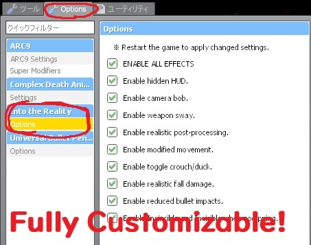

# Into the Reality (GMOD Addon)

— an all-in-one realism gameplay pack for Garry's Mod

[Link to Workshop steam addon](https://steamcommunity.com/sharedfiles/filedetails/?id=3649105117)

[Link to gameplay walkthrough (YouTube)](https://youtu.be/FJcy_iqmzbs?si=kcjfGCT8ZmEFJ9mf)



### Implemented features:
* **Post-Processing** Targets an EdgeLUT-like cinematic rendering pipeline using Contrast Adaptive Sharpening (AMD) and Curved Levels
* **Vanilla Enhancements** NoClip grants godmode, invisibility, and improved mobility; intensified muzzle flash; crouch toggle
* **Misc** Crosshair/HUD suppression, reduced movement speed, realistic fall damage and bullet impact, and more
* **Dynamic Camera** Smooth camera movement via linear interpolation, noise-based head bob, weapon sway

### Background
Referenced ReShade, encoded `.fx` to `.hlsl`, then compiled to `ps20b.vcs` via [shader compiler](https://github.com/ficool2/sdk_screenspace_shaders/blob/main/shadersrc/bin/ShaderCompile.exe).
```vmt
screenspace_general 
{
    $pixshader "bodycam2_ps20b"
    $basetexture "_rt_FullFrameFB"
    $ignorez 1
    $vertextransform 1
}
```
```hlsl
sampler s0: register(s0);
// float2  p1: register(c0);
#define px 1/1920 // p1.x
#define py 1/1080 // p1.y
// Contrast Adaptive Sharpening
#define peak (3*CAS -8.) // must be <0
#define CAS 0.7 // Default Intensity 0.35
#define texo(x, y) tex2D(s0, tex + float2(x, y)).rgb
#define min4(x1, x2, x3, x4) min(min(x1, x2), min(x3, x4))
#define max4(x1, x2, x3, x4) max(max(x1, x2), max(x3, x4))
#define CoefLuma float3(0.212656, 0.715158, 0.072186) // BT.709
float4 fxCAS(float2 tex, float4 ori) {
    float3 c2 = texo( 0,-py); float3 c4 = texo(-px,  0);
    float3 c6 = texo(px,  0); float3 c8 = texo(  0, py);
    float3 minRGB = min( min4(c2, c4, c6, c8), ori.rgb);
    float3 maxRGB = max( max4(c2, c4, c6, c8), ori.rgb);
    c2 = c2 + c4 + c6 + c8;
    float3 c1 = texo(-px,-py); float3 c3 = texo(px,-py);
    float3 c7 = texo(-px, py); float3 c9 = texo(px, py);
    minRGB+= min(minRGB,min4(c1, c3, c7, c9));
    maxRGB+= max(maxRGB,max4(c1, c3, c7, c9));
    minRGB = min(minRGB, 2-maxRGB); float3 ampRGB = minRGB * rcp( maxRGB );
    float3 wRGB = sqrt(ampRGB) *1.0/peak; float3 sharp = ori.rgb + c2*wRGB;
    sharp = saturate(sharp*rcp(4*wRGB +1.)); ori.rgb = sharp; return ori; }
// CurvedLevels
struct TonemapParams {
    float3 mToe;float2 mMid;
    float3 mShoulder; float2 mBx; };
float3 Tonemap(const TonemapParams tc, float3 x) {
    float3 toe = - tc.mToe.x / (x + tc.mToe.y) + tc.mToe.z;
    float3 mid = tc.mMid.x * x + tc.mMid.y;
    float3 shoulder = - tc.mShoulder.x / (x + tc.mShoulder.y) + tc.mShoulder.z;
    float3 result = ( x >= tc.mBx.x ) ? mid : toe; result = ( x >= tc.mBx.y ) ? shoulder : result; return result; }
float3 blackwhiteIN( float3 c, float b, float w ) { return saturate( c.xyz - b )/max( w - b, 0.000001f ); }
float blackwhiteIN( float c, float b, float w ) { return saturate( c - b )/max( w - b, 0.000001f ); }
float3 blackwhiteOUT( float3 c, float b, float w ) { return c.xyz * saturate( w - b ) + b; }
float blackwhiteOUT( float c, float b, float w ) { return c * saturate( w - b ) + b; }
float4 setBoundaries( float tx, float ty, float sx, float sy ) {
    if( tx > sx ) tx = sx; if( ty > sy ) ty = sy;
    return float4( tx, ty, sx, sy ); }
void PrepareTonemapParams(float2 p1, float2 p2, float2 p3, out TonemapParams tc) {
    float denom = p2.x - p1.x; denom = abs(denom) > 1e-5 ? denom : 1e-5;
    float slope = (p2.y - p1.y) / denom;
    {
        tc.mMid.x = slope;
        tc.mMid.y = p1.y - slope * p1.x;
    } {
        float denom = p1.y - slope * p1.x;
        denom = abs(denom) > 1e-5 ? denom : 1e-5;
        tc.mToe.x = slope * p1.x * p1.x * p1.y * p1.y / (denom * denom);
        tc.mToe.y = slope * p1.x * p1.x / denom;
        tc.mToe.z = p1.y * p1.y / denom;
    } {
        float denom = slope * (p2.x - p3.x) - p2.y + p3.y; denom = abs(denom) > 1e-5 ? denom : 1e-5;
        tc.mShoulder.x = slope * pow(p2.x - p3.x, 2.0) * pow(p2.y - p3.y, 2.0) / (denom * denom);
        tc.mShoulder.y = (slope * p2.x * (p3.x - p2.x) + p3.x * (p2.y - p3.y) ) / denom;
        tc.mShoulder.z = (-p2.y * p2.y + p3.y * (slope * (p2.x - p3.x) + p2.y) ) / denom;
    }
    tc.mBx = float2(p1.x, p2.x); }
float4 fxCL(float2 texcoord, float4 inputColor) {
        float4 color = inputColor;
        float2 coords = float2((texcoord.x - 0.75f) * 4.0f, (1.0f - texcoord.y) * 4.0f);
        float4 dnoise = float4(0, 0, 0, 0); color.xyz = saturate(color.xyz + dnoise.yzx);
        TonemapParams tc;
        float bigr        = saturate( 0. + dnoise.w );
        float wigr        = saturate( 1. + dnoise.w );
        float bogr        = saturate( 0. + dnoise.w );
        float wogr        = saturate( 1. + dnoise.w );
        float4 grey       = setBoundaries( 0.03f, 0.12f, 0.999f, 0.991f );
        PrepareTonemapParams( grey.xy, grey.zw, float2( 1.0f, 1.0f ), tc );
        color.xyz         = blackwhiteIN( color.xyz, bigr, wigr );
        color.xyz         = Tonemap( tc, color.xyz );
        color.xyz         = blackwhiteOUT( color.xyz, bogr, wogr );
        float bir         = saturate( 0. + dnoise.x );
        float wir         = saturate( 1. + dnoise.x );
        float bor         = saturate( 0. + dnoise.x );
        float wor         = saturate( 1. + dnoise.x );
        float4 red        = setBoundaries( 0.25f, 0.25f, 0.75f, 0.75f );
        PrepareTonemapParams( red.xy, red.zw, float2( 1.0f, 1.0f ), tc );
        color.x           = blackwhiteIN( color.x, bir, wir );
        color.x           = Tonemap( tc, color.xxx ).x;
        color.x           = blackwhiteOUT( color.x, bor, wor );
        float big         = saturate( 0. + dnoise.y );
        float wig         = saturate( 1. + dnoise.y );
        float bog         = saturate( 0. + dnoise.y );
        float wog         = saturate( 1. + dnoise.y );
        float4 green      = setBoundaries( 0.25f, 0.25f, 0.75f, 0.75f );
        PrepareTonemapParams( green.xy, green.zw, float2( 1.0f, 1.0f ), tc );
        color.y           = blackwhiteIN( color.y, big, wig );
        color.y           = Tonemap( tc, color.yyy ).y;
        color.y           = blackwhiteOUT( color.y, bog, wog );
        float bib         = saturate( 0. + dnoise.z );
        float wib         = saturate( 1. + dnoise.z );
        float bob         = saturate( 0. + dnoise.z );
        float wob         = saturate( 1. + dnoise.z );
        float4 blue       = setBoundaries( 0.25f, 0.25f, 0.75f, 0.75f );
        PrepareTonemapParams( blue.xy, blue.zw, float2( 1.0f, 1.0f ), tc );
        color.z           = blackwhiteIN( color.z, bib, wib );
        color.z           = Tonemap( tc, color.zzz ).z;
        color.z           = blackwhiteOUT( color.z, bob, wob );
        return float4( color.xyz, 1.0f ); }
float4 main(float2 tex: TEXCOORD0) : COLOR { return fxCAS( tex, fxCL(tex, tex2D(s0, tex) ) ); }
```
Also this addon works without any third-party API.

### Recommended addons:
* [ARC9] Modern Warfare 2019 https://github.com/CurlySparkle/ARC9-COD2019
* [ARC9] SCP 5K Weapons(WIP) https://github.com/CraftPig/arc9_scp5k_weapons

### Special thanks to:
* https://github.com/meetric1 — Wrote The Comprehensive GMod Shader Guide, a well-structured tutorial on GMod shaders.
* https://github.com/Akabenko — Author of GShader Library, who helped me understand EGSM DLL and Source Engine internals.